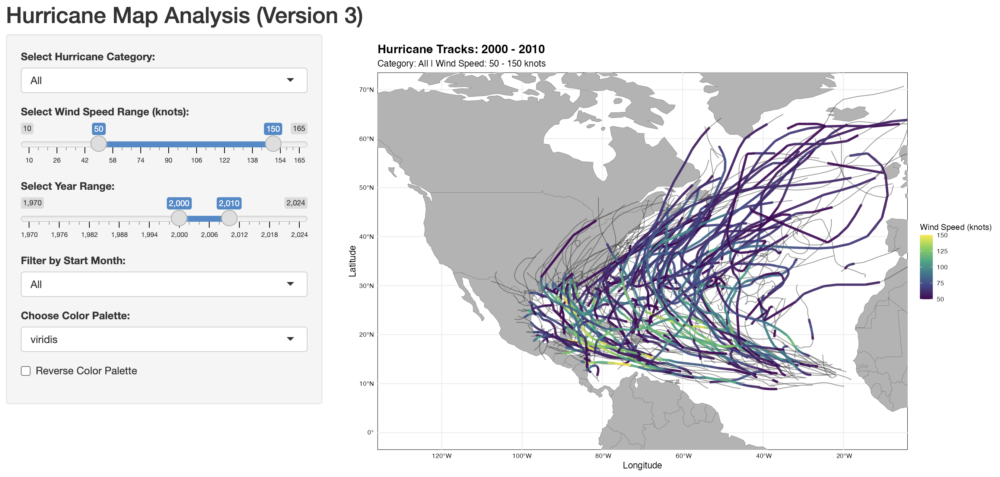

Author: Mikaella Liveri

Year: Spring 2025

This folder includes a Shiny app that visualizes historical hurricane tracks. Users can filter hurricanes based on category, wind speed, year range, and month. The app provides an interactive map where storms are color-coded by wind speed, with a customizable color palette and the option to reverse colors.

Details:
- Uses the ibtracs dataset to visualize hurricane tracks.
- Filters storms based on user input (year, wind speed, category, and month).
- Provides multiple color palette options for visualization.
- Users can reverse the color scale for better contrast.

Inputs:
- ibtracs dataset (CSV file): Contains hurricane details including ID, year, wind speed, latitude, and longitude.
- User-selected filters:
  - Hurricane category
  - Wind speed range
  - Year range
  - Start month
  - Color palette (Viridis, Magma, Plasma, Inferno)
  - Option to reverse color scale

Output:
- Interactive map plot displaying hurricane tracks.
- Color-coded wind speed representation with customizable palette.
- Highlighted storm paths based on selected filters.



To run the app in RStudio, execute the following code in R:

```r
library(shiny)

# Run an app from a subdirectory in the repo
runGitHub(
repo="Hurricane-Analysis",
username = "mikaliveri",
subdir = "Shiny-apps/Hurricane_Map_Analysis_Normal"
)