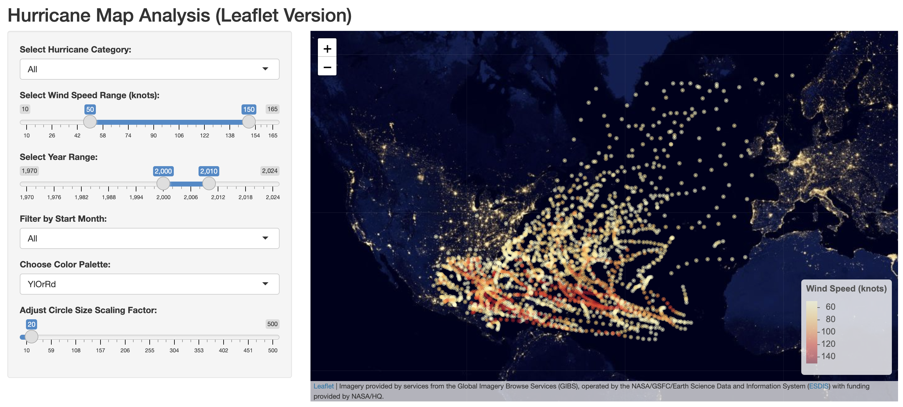

Author: Mikaella Liveri

Year: Spring 2025

This folder includes a # Description: Visualizes hurricane data in the NA.

Details: Size of circles are proporional to the wind speed. Users can adjust the color palette and the scaling factor for the circle size.

Inputs: ibtracs.NA.list.v04r01.csv

Output: Leaflet map showing hurricane locations, color-coded and sieze adjusted  according to wind speed.



To run the app in RStudio, execute the following code in R:

```r
library(shiny)

# Run an app from a subdirectory in the repo
runGitHub(
repo="Hurricane-Analysis",
username = "mikaliveri",
subdir = "Shiny-apps/Leaflet_ShinyApp"
)