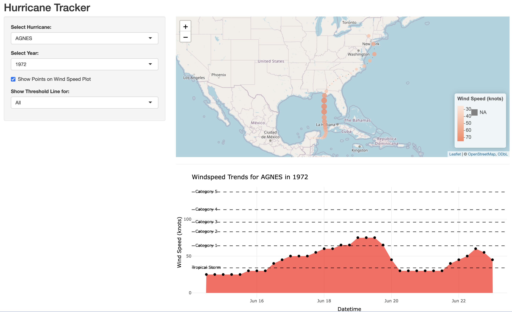

Author: Mikaella Liveri

Year: Spring 2025

Title: Wind_Speed_Version_2

Description:
This Shiny app allows users to track and analyze hurricanes based on their 
wind speed and location. Users can select a hurricane by name and then choose 
the specific year if the hurricane has occurred multiple times.

Details:
- Uses the ibtracs dataset to visualize hurricane paths and wind speeds.
- Filters hurricanes by name first, then year dynamically.
- Displays a Leaflet map showing the hurricane's track.
- Plots a wind speed trend graph with storm categories.

Inputs:
- ibtracs dataset (CSV file): Contains hurricane details including ID, 
  year, wind speed, latitude, and longitude.
- User-selected filters:
  - Hurricane name (dropdown, ordered alphabetically)
  - Hurricane year (dropdown, updates dynamically)

Output:
- Interactive map plot displaying hurricane tracks.
- Wind speed trend visualization for selected hurricanes.




To run the app in RStudio, execute the following code in R:

```r
library(shiny)

# Run an app from a subdirectory in the repo
runGitHub(
repo="Hurricane-Analysis",
username = "mikaliveri",
subdir = "Shiny-apps/Wind_Speed_Version_2"
)